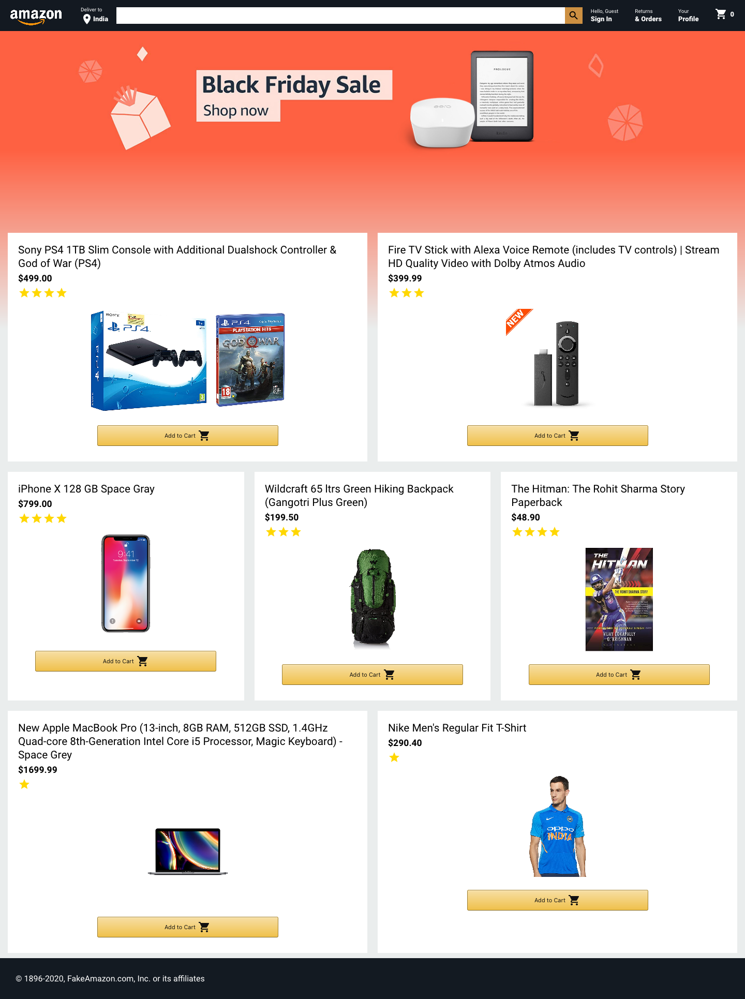
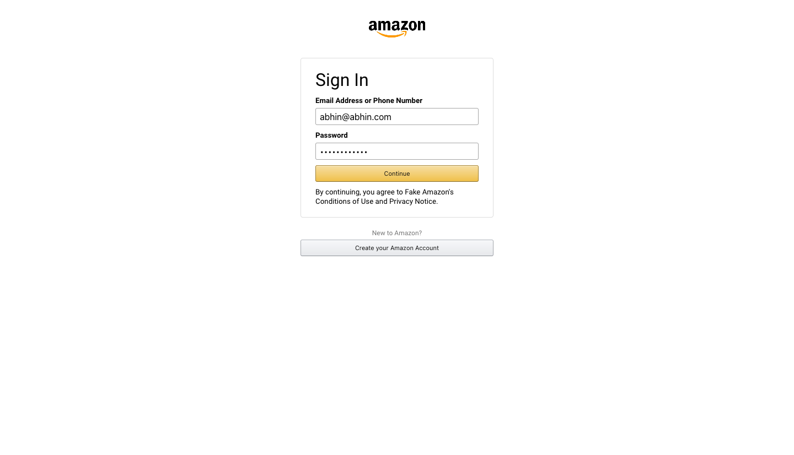
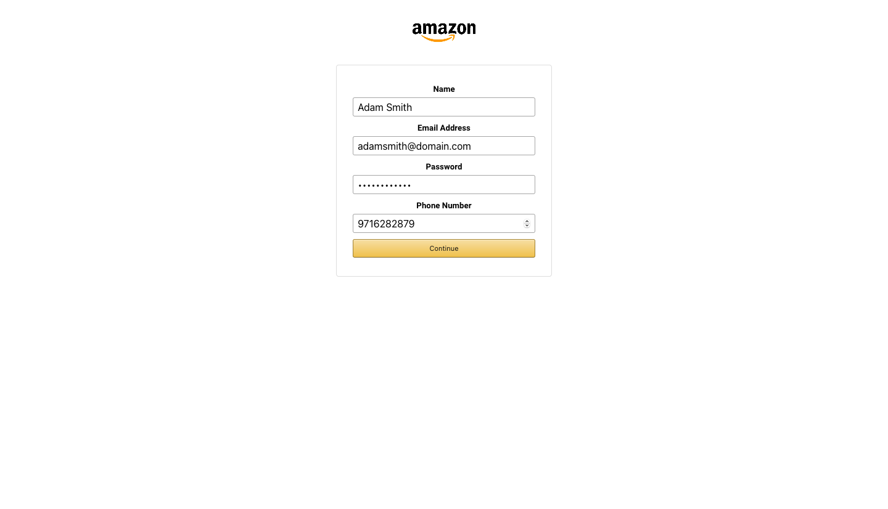
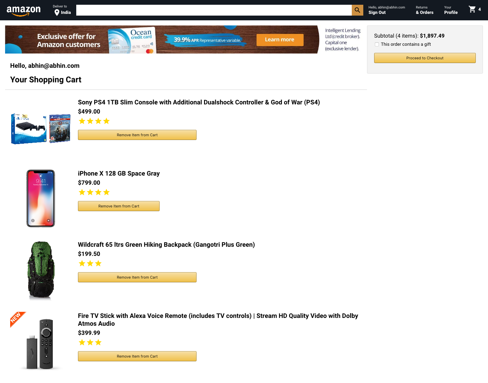
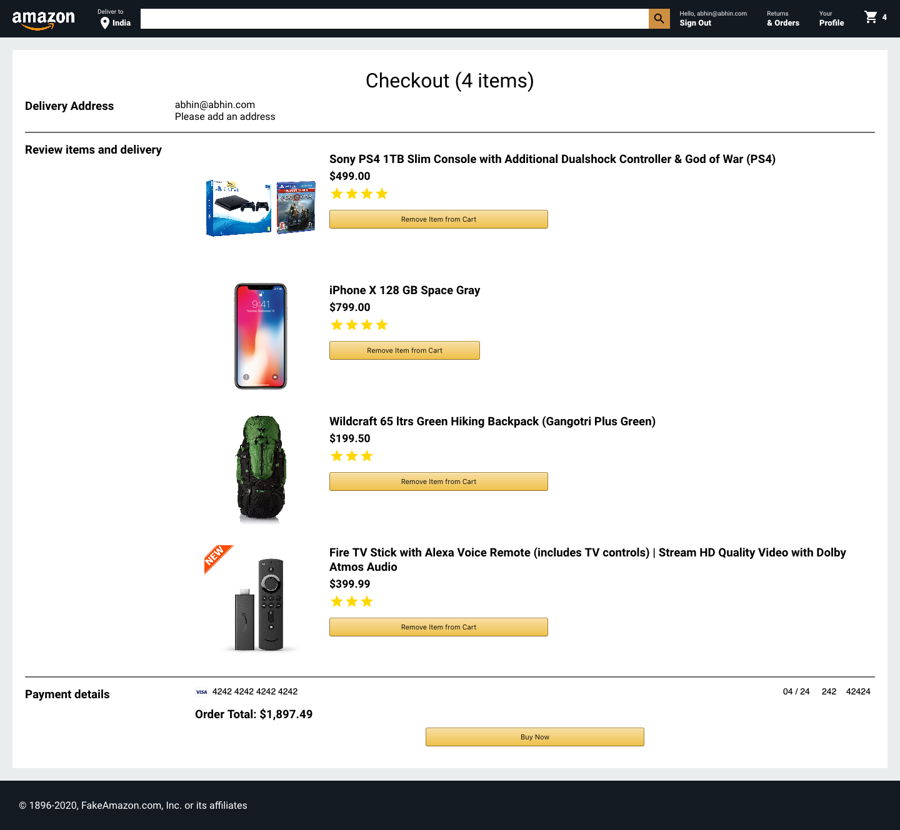
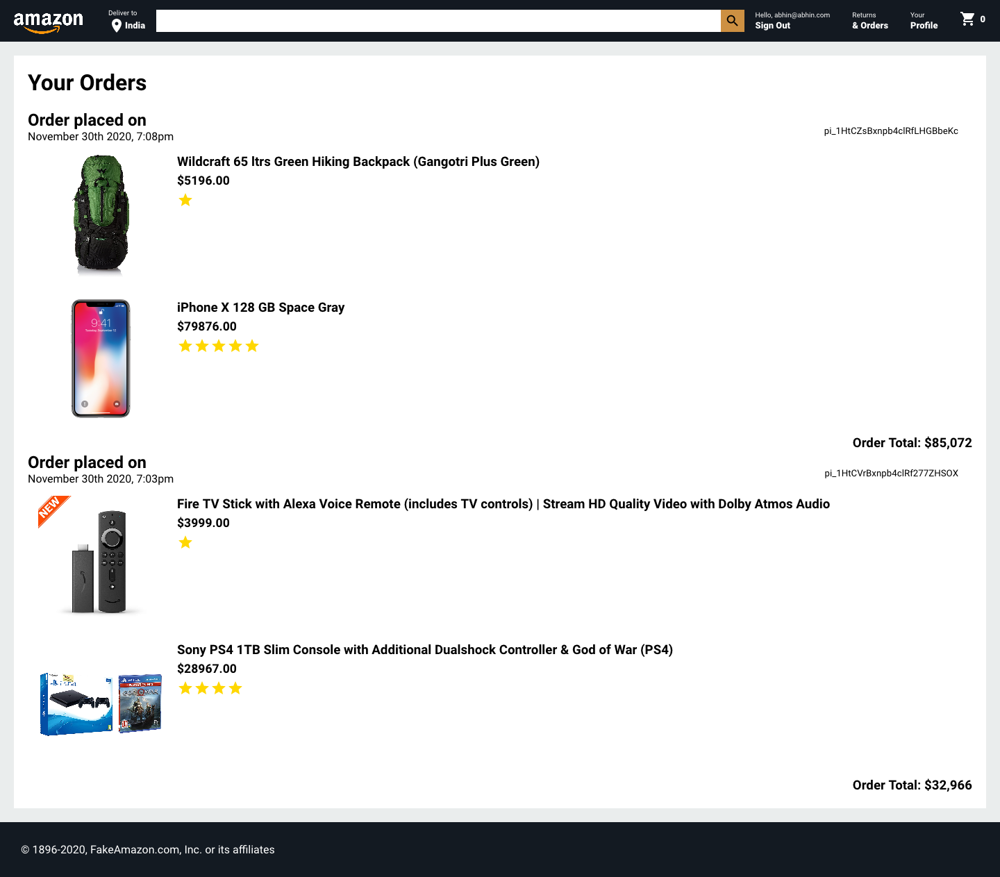

# Amazon Clone

One of my most special projects as this helped me solidify my React.js concepts. This is minified version of the online Amazon store.

## Table of Contents

- [Key Features](#key-features)
- [Technologies](#technologies)
- [Setup](#setup)
- [Screenshots](#screens)
- [Status](#status)

## Key features

- User Authentication (Login and Register)
- Order History for Individual Users
- Card Payments using Stripe
- Dynamic Cart Updates (Add or Remove Products)

## Technologies

- Node >= v14
- Express v4.17
- React.js v17
- Stripe v8.126
- Firebase v8
- Axios
- CORS
- MaterialUI

## Setup

- To install, clone the repository using either Git or as a Zip file.
- Install all the dependencies, by executing the following command in the root folder:
  `npm install`
- In the src/utils folder, create a firebaseConfig.js file, and copy-paste the Configuration snippet from your Firebase Console.
- In the root directory, run `npm start` and in the node-backend directory, run `node server.js`

## Screenshots

#### Home Page

#### Login Page

#### Registration Page

#### Order Checkout Page

#### Payment Processing Page

#### Order History Page

## Status

Here are the features which can be added to the current version:

- Individual User Profile for Profile Updates (Phone Number, Address, etc)
- Individual Product Page
- A Seller Page to add new products

...and I'm working on these ;)
